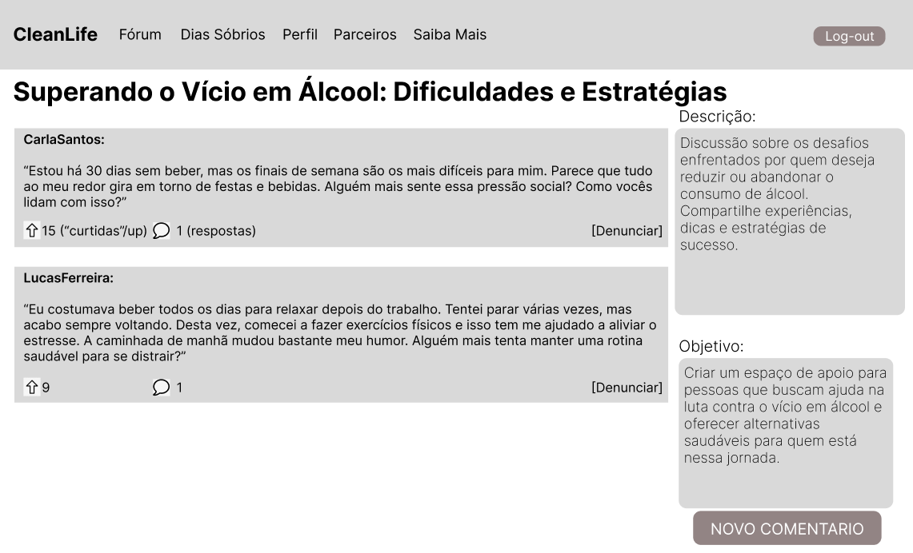

# Introdução

Informações básicas do projeto.

* **Projeto:** CleanLife 
* **Repositório GitHub:** https://github.com/ICEI-PUC-Minas-PPLCC-TI/ti-1-ppl-cc-m-2024-2-cleanlife
* **Membros da equipe:**

  * <a href="https://github.com/sevak19">Arthur Costa Serra Negra</a>
  * <a href="https://github.com/BernardoPiresMascarenhas">Bernardo Pires Mascarenhas</a>
  * <a href="https://github.com/Porosa">Enzo Piacenza Werneck da Rocha</a>
  * <a href="https://github.com/lucasstc">Lucas Stancioli Siqueira</a>
  * <a href="https://github.com/samuellagee">Samuel Lage Spalla Fajardo</a>
  * <a href="https://github.com/Pedrouo">Pedro Fonseca Silva</a>
  

A documentação do projeto é estruturada da seguinte forma:

1. Introdução
2. Contexto
3. Product Discovery
4. Product Design
5. Metodologia
6. Solução
7. Referências Bibliográficas

✅ [Documentação de Design Thinking (MIRO)](files/processo-dt.pdf)

# Contexto

## Problema

O vício em drogas continua sendo um grande desafio global, afetando não so a vida dos usuarios mas também seus famíliares, amigos e a sociedade em geral. Embora existam muitas formas de tratamento, a falta de apoio social e emocional frequentemente dificulta a recuperação. Muitos usuários enfrentam estigma social e dificuldades em buscar ajuda, o que resulta em isolamento e recaídas.

Atualmente, há uma lacuna significativa em plataformas que promovam um espaço seguro, colaborativo e acessível para que essas pessoas possam compartilhar suas histórias, obter aconselhamento e encontrar uma comunidade de apoio.

Embora existam métodos clínicos e terapêuticos disponíveis para tratar o vício, muitos dependentes não têm acesso contínuo a redes de apoio ou desistem do tratamento por falta de suporte social. O estigma associado ao vício muitas vezes impede os indivíduos de buscar ajuda, levando-os ao isolamento, o que agrava as chances de recaída. Além disso, as famílias e amigos, que desempenham um papel crucial na recuperação, muitas vezes se sentem despreparados para oferecer suporte adequado.

O contexto em que essa aplicação será usada envolve o ambiente digital, onde viciados, ex-viciados, familiares e especialistas poderão interagir sem medo de julgamento, de forma anônima e segura. O uso de tecnologias voltadas para fóruns, redes sociais e troca de mensagens será essencial para facilitar a comunicação e a troca de experiências entre os participantes. A aplicação se insere em um cenário onde a conectividade e o acesso a informações são fundamentais, criando um ponto de encontro virtual para uma comunidade que, de outra forma, seria difícil de organizar e sustentar.

Este ambiente digital pretende aproveitar a ubiquidade da internet e dispositivos móveis para fornecer suporte contínuo e de fácil acesso a qualquer hora e lugar, garantindo que os usuários possam recorrer à plataforma sempre que necessário.

## Objetivos

O principal objetivo do *CleanLife* é desenvolver um software que ofereça um espaço digital acolhedor e seguro onde pessoas em processo de recuperação de vícios possam interagir, compartilhar experiências e buscar apoio mútuo. Esse software tem como meta solucionar o problema do isolamento e da falta de suporte emocional e social enfrentados por muitos dependentes, criando uma plataforma que promova a troca de conhecimentos e vivências entre os participantes.

**O objetivo geral** do *CleanLife* é criar uma aplicação que facilite a formação de uma comunidade colaborativa, onde os usuários possam encontrar força e apoio para superar o vício. Para isso, a plataforma será desenvolvida com foco na acessibilidade, permitindo que viciados, ex-viciados, familiares e especialistas interajam de forma anônima, troquem conselhos e ofereçam suporte uns aos outros, independentemente de suas localizações geográficas.

### Objetivos específicos:

**Promover um ambiente digital seguro e anônimo:**
- Um dos principais focos do projeto é garantir que os usuários possam participar da plataforma sem medo de julgamento ou exposição. Isso será alcançado através do desenvolvimento de mecanismos de anonimato e moderação eficaz, criando um espaço onde os usuários se sintam à vontade para compartilhar suas experiências e buscar apoio sem constrangimento.

**Mapear e identificar as melhores práticas de moderação e suporte em comunidades online:**
- Estudar outras plataformas de fóruns e redes de apoio, identificando estratégias de sucesso em termos de moderação, apoio mútuo e engajamento dos usuários. Aplicar essas práticas no *CleanLife* para criar um ambiente virtual seguro e acolhedor.

**Facilitar a integração de recursos úteis para a recuperação:**
- Integrar na plataforma materiais educativos e recursos práticos, como links para clínicas de reabilitação, métodos de tratamento, e artigos sobre saúde mental e dependência. Através dessas funcionalidades, o *CleanLife* oferecerá mais do que apenas um fórum de discussão, tornando-se uma ferramenta abrangente para auxiliar o processo de recuperação.

Esses objetivos específicos permitem ir além da simples comunicação entre usuários, criando um espaço digital que não apenas promove o fortalecimento pessoal, mas também proporciona acesso a informações vitais para a superação do vício.

## Justificativa

A necessidade de apoio emocional e social no processo de recuperação do vício é amplamente reconhecida por profissionais da saúde mental, terapeutas e pela própria comunidade de pessoas em reabilitação. No entanto, existe uma lacuna significativa em plataformas que ofereçam esse suporte de forma acessível, segura e anônima. O projeto *CleanLife* justifica-se por preencher essa lacuna, oferecendo um espaço digital que promove a interação entre indivíduos em diferentes estágios de recuperação, ex-viciados, familiares e profissionais, criando uma rede de apoio onde os usuários podem compartilhar suas histórias, trocar conselhos e se sentirem acolhidos em um ambiente livre de julgamento.

### Por quê?
Potencial de impactar diretamente a vida de pessoas em recuperação, ao atender a uma necessidade crítica de suporte contínuo e acessível. O isolamento social, o estigma e a falta de redes de apoio são barreiras significativas para aqueles que lutam contra o vício. A escolha desse tema reflete a oportunidade de usar a tecnologia para criar uma comunidade digital que encoraje o fortalecimento pessoal e a superação do vício por meio do apoio mútuo.

### O quê?
A função do *CleanLife* é fornecer uma plataforma digital que atue como uma rede de suporte emocional e social. A plataforma visa facilitar a troca de experiências e informações, além de promover um ambiente colaborativo onde os participantes possam se sentir compreendidos e motivados a continuar sua jornada de recuperação. Através de funcionalidades como fóruns de discussão anônimos, recursos educativos e acompanhamento do progresso pessoal, o *CleanLife* ajudará os usuários a reduzirem o sentimento de isolamento.

### Quem?
O público-alvo do *CleanLife* inclui:

- Pessoas em processo de recuperação de vícios: que necessitam de um espaço seguro para buscar apoio e compartilhar suas experiências.
- Ex-viciados: que podem contribuir com suas histórias de sucesso e fornecer conselhos para aqueles que estão nos estágios iniciais de recuperação.
- Familiares e amigos de dependentes: que também buscam orientação sobre como ajudar seus entes queridos no processo de recuperação.
- Profissionais de saúde mental e especialistas em reabilitação: que podem fornecer aconselhamento e recursos especializados.

### Base
O trabalho do *CleanLife* está fundamentado em dados coletados por meio de pesquisas, entrevistas com o público-alvo, entrevistas com profissionais da área de saúde mental e dependência, além de estatísticas sobre a eficácia do suporte emocional no processo de recuperação. A escolha dos objetivos foi guiada por essas informações, que apontam para a importância de criar um ambiente seguro e anônimo, com recursos acessíveis e fáceis de usar, que respondam diretamente às principais dificuldades enfrentadas por quem esta no processo de recuperação.

Estudos mostram que plataformas digitais têm o potencial de aumentar o engajamento e o sucesso em tratamentos de vício, mas ainda faltam espaços voltados especificamente para o apoio emocional e social. A criação de um ambiente onde a troca de experiências e a solidariedade são incentivadas se baseia também em teorias de resiliência e comunidades de prática, onde o compartilhamento de conhecimentos e vivências fortalece os indivíduos e suas capacidades de enfrentamento.

Portanto, o *CleanLife* se justifica não apenas pela inovação tecnológica, mas pela oportunidade de criar um espaço que se torne um ponto de apoio crucial no processo de reabilitação, impactando positivamente a vida de seus usuários e promovendo um caminho mais acessível para a recuperação.

## Público-Alvo

O público-alvo do *CleanLife* abrange diferentes perfis de usuários, todos conectados pela busca por apoio no processo de recuperação do vício em drogas. Esse público inclui:

1. Pessoas em recuperação ou em busca de tratamento: Indivíduos que estão enfrentando ou já enfrentaram o vício e desejam uma rede de suporte emocional e social. São usuários que, em sua maioria, podem não ter grande familiaridade com a tecnologia, mas buscam uma plataforma intuitiva e acessível que lhes permita interagir anonimamente, trocando experiências com outras pessoas na mesma jornada. Muitos desses indivíduos podem já ter passado por tratamentos em clínicas de reabilitação, mas ainda necessitam de acompanhamento contínuo e suporte emocional.

2. Familiares e amigos de dependentes: Um grupo que, muitas vezes, busca entender melhor como ajudar e lidar com seus entes queridos que enfrentam o vício. Eles podem usar a plataforma para buscar orientação e participar de discussões que os ajudem a compreender melhor o processo de recuperação e oferecer apoio efetivo. Embora possam ter maior familiaridade com o uso de plataformas digitais, sua principal motivação é o acesso rápido e confiável a informações e apoio.

3. Profissionais de saúde mental e reabilitação: Psiquiatras, psicólogos, terapeutas e outros especialistas na área de saúde mental e dependência química também fazem parte do público-alvo. Esses profissionais podem utilizar o *CleanLife* como uma ferramenta de extensão para monitorar o progresso de seus pacientes, interagir com a comunidade e fornecer orientações baseadas em evidências. Como esse público tem mais familiaridade com tecnologias de acompanhamento de pacientes e fóruns de discussão profissional, podem valorizar recursos avançados de monitoramento e gestão.

4. ONGs e organizações de reabilitação: Instituições que trabalham diretamente com a recuperação e reinserção social de pessoas dependentes de drogas também podem usar a plataforma como um canal adicional de suporte. Essas organizações podem integrar seus serviços ao *CleanLife* para fornecer apoio e aconselhamento contínuo, alcançando os participantes de forma mais direta e eficaz.

### Personas:
- Persona 1: João, 34 anos, em recuperação há 6 meses
João já passou por tratamento em uma clínica, mas sente que ainda precisa de apoio constante para evitar recaídas. Ele tem pouca experiência com tecnologia e busca uma plataforma simples e acessível onde possa compartilhar sua jornada de forma anônima.

- Persona 2: Maria, 45 anos, mãe de um adolescente em recuperação
Maria está desesperada para ajudar seu filho, mas não sabe por onde começar. Ela quer uma plataforma onde possa aprender mais sobre o vício e conversar com outras mães que passaram pela mesma situação.

- Persona 3: Dr. Ricardo, 52 anos, psicólogo especialista em dependência química
Dr. Ricardo usa a tecnologia no dia a dia para acompanhar seus pacientes e está sempre em busca de novas ferramentas que possam melhorar o processo de recuperação. Ele vê o CleanLife como uma extensão de seu consultório, onde pode monitorar discussões e oferecer suporte especializado.

Esses perfis demonstram como a plataforma *CleanLife* atende a uma diversidade de usuários com diferentes níveis de conhecimento tecnológico e diversas relações com o problema do vício, oferecendo soluções personalizadas e focadas nas necessidades de cada grupo.

# Product Discovery

## Etapa de Entendimento

**✳️✳️✳️ APRESENTE OS ARTEFATOS DA ETAPA  ✳️✳️✳️**

> ⚠️ **APAGUE ESSA PARTE ANTES DE ENTREGAR SEU TRABALHO**
>
> Nessa etapa, vamos trabalhar com a metdologia de Design Thinking para compreender com maior profundidade o problema a ser tratado. Nesse processo, vamos elaborar:
>
> * **Matriz CSD**: também conhecida por Matriz de Alinhamento, é uma ferramenta utilizada no Design Thinking para organizar informações e facilitar o processo de tomada de decisão e solução de problemas;
> * **Mapa de stakeholders**: ferramenta que nos permite compreender o grupo de pessoas e entidades que devemos estudar e conversar para entender mais sobre o problema
> * **Entrevistas qualitativas**: série de entrevistas qualitativas para validar suposições e solucionar as dúvidas com as principais pessoas envolvidas;
> * **Highlights de pesquisa**: um compilado do levantamento realizado por meio das entrevistas.

## Etapa de Definição

### Personas

**✳️✳️✳️ APRESENTE OS DIAGRAMAS DE PERSONAS ✳️✳️✳️**

> ⚠️ **APAGUE ESSA PARTE ANTES DE ENTREGAR SEU TRABALHO**
>
> Relacione as personas identificadas no seu projeto e os respectivos mapas de empatia. Lembre-se que você deve ser enumerar e descrever precisamente e de forma personalizada todos os principais envolvidos com a solução almeja.
>
> **Orientações**:
>
> - [Persona x Público-alvo](https://flammo.com.br/blog/persona-e-publico-alvo-qual-a-diferenca/)
> - [O que é persona?](https://resultadosdigitais.com.br/blog/persona-o-que-e/)
> - [Rock Content](https://rockcontent.com/blog/personas/)
> - [Criar personas (Hotmart)](https://blog.hotmart.com/pt-br/como-criar-persona-negocio/)

# Product Design

Nesse momento, vamos transformar os insights e validações obtidos em soluções tangíveis e utilizáveis. Essa fase envolve a definição de uma proposta de valor, detalhando a prioridade de cada ideia e a consequente criação de wireframes, mockups e protótipos de alta fidelidade, que detalham a interface e a experiência do usuário.

## Histórias de Usuários

Com base na análise das personas foram identificadas as seguintes histórias de usuários:

| EU COMO...`PERSONA` | QUERO/PRECISO ...`FUNCIONALIDADE`        | PARA ...`MOTIVO/VALOR`               |
| --------------------| -----------------------------------------| -------------------------------------- |
| Usuário anônimo     | Criar uma conta no fórum. | Poder participar das discussões, criar tópicos e comentar anonimamente.             |
| Usuário registrado  | Criar um novo tópico sobre um tema específico. | Discutir minha experiência com vícios e obter ajuda e conselhos de outros membros da comunidade. |
| Usuário registrado  | Denunciar um conteúdo que considero ofensivo ou perigoso. | Para que os moderadores possam tomar providências e manter o fórum um lugar seguro para todos. |
| Usuário registrado  | Pesquisar tópicos usando palavras-chave relacionadas ao tema.  | Encontrar discussões e informações rapidamente sobre questões específicas que me interessam. |
| Usuário registrado  | Editar minhas informações de perfil e escolher um pseudônimo.  | Garantir minha privacidade e personalizar meu perfil no fórum. |
| Usuário registrado  | Responder a tópicos com meus comentários.  | Compartilhar minha experiência ou opinião e ajudar outros usuários com suas dúvidas ou preocupações. |


## Proposta de Valor

**✳️✳️✳️ APRESENTE O DIAGRAMA DA PROPOSTA DE VALOR PARA CADA PERSONA ✳️✳️✳️**

##### Proposta para Persona XPTO ⚠️ EXEMPLO ⚠️


> ⚠️ **APAGUE ESSA PARTE ANTES DE ENTREGAR SEU TRABALHO**
>
> O mapa da proposta de valor é uma ferramenta que nos ajuda a definir qual tipo de produto ou serviço melhor atende às personas definidas anteriormente.

## Requisitos

As tabelas que se seguem apresentam os requisitos funcionais e não funcionais que detalham o escopo do projeto.

### Requisitos Funcionais

| ID     | Descrição do Requisito                                   | Prioridade |
| ------ | ---------------------------------------------------------- | ---------- |
| RF-001 |  O sistema deve permitir que os usuários criem uma conta com um e-mail válido, senha e opcionalmente um pseudônimo para garantir anonimato. | ALTA       |
| RF-002 |  O sistema deve permitir que os usuários realizem login com suas credenciais e façam logout de forma segura. | ALTA     |
| RF-003 |  O sistema deve permitir que os usuários criem novos tópicos relacionados ao tema de vícios, com título, descrição e palavras-chave. | MÉDIA     |
| RF-004 |  O sistema deve permitir que os usuários respondam aos tópicos com comentários, possibilitando a interação e discussão sobre o tema abordado. | MÉDIA     |
| RF-005 |  O sistema deve permitir que moderadores designados possam aprovar ou remover tópicos e comentários que infrinjam as regras do fórum. | ALTA     |
| RF-006 |  O sistema deve permitir que os usuários denunciem conteúdo inadequado (como apologia a drogas ou uso de linguagem ofensiva) para que seja avaliado pelos moderadores.| ALTA    |
| RF-007 | O sistema deve permitir que os usuários classifiquem os tópicos (ex: relevante, útil, etc.). | BAIXA    |
| RF-008 | O sistema deve oferecer uma funcionalidade de busca, permitindo que os usuários localizem tópicos e discussões por palavras-chave ou categorias.| MÉDIA     |
| RF-009 | O sistema deve permitir que os usuários visualizem e editem seus perfis, incluindo informações pessoais. | MÉDIA     |
| RF-0010 | O sistema deve fazer uma contagem de dias sobrios para cada usuarios, e permitir que eles resetem tal contagem. | MÉDIA     |


### Requisitos não Funcionais

| ID      | Descrição do Requisito                                                              | Prioridade |
| ------- | ------------------------------------------------------------------------------------- | ---------- |
| RNF-001 | O sistema deve ser simples de navegar, com uma interface amigável para diferentes tipos de usuários, incluindo aqueles com pouca experiência tecnológica | ALTA    |
| RNF-002 | O sistema deve ser compatível com os navegadores mais comuns (Chrome, Firefox e Edge) e funcionar tanto em dispositivos móveis quanto em desktops.  | MÉDIA      |
| RNF-003 | Uso do mesmo css: O design da interface deve utilizar o mesmo estilo css, para ficar linear.  | BAIXA      |
| RNF-004 | O sistema deve implementar apenas as funcionalidades essenciais para o fórum, deixando recursos avançados para futuras iterações. | MÉDIA      |

## Projeto de Interface

Artefatos relacionados com a interface e a interacão do usuário na proposta de solução.

### Wireframes

Estes são os protótipos de telas do sistema.

##### Tela de Boas-Vindas / Sobre Nós

A primeira tela que o usuário vê ao acessar a plataforma. Ela apresenta o CleanLife de forma acolhedora e explica a missão da plataforma, destacando a importância da comunidade no processo de recuperação.

.png)

##### Tela dos Foruns / HOME

Após o login, o usuário é direcionado para a tela principal da plataforma, onde pode visualizar tópicos populares, acessar fóruns e criar seu proprio forum.

.png)

Podendo tambem criar um novo Forum


##### Tela do Forum

Página dedicada a um fórum específico, com o título do tema em destaque, postagens e comentários.



Podendo tambem entrar em um comentario especifico


Exemplo de Forum vazio (novo)


##### Tela de Busca

Tela onde o usuario pode pesquisar o forum de seu interesse.


##### Tela do Contador de Dias Sobrios

Tela onde o usuário visualiza há quanto tempo está sóbrio, acompanhando seu progresso e batendo metas.


Podendo reiniciar o contador


##### Tela do Perfil

Tela onde o usuário visualiza seu perfil.


Podendo editar suas informações


##### Tela dos Parceiros

Tela onde o usuário encontra clinicas parceiras.


##### Tela Saiba Mais

Tela onde o usuário encontra artigos que recomendamos, e tambem pode pesquisar por artigos de seu interesse.


### User Flow


### Protótipo Interativo

✅ [Protótipo Interativo (Figma)](https://www.figma.com/proto/upou2SRsBvZQiLatAZVL2w/Untitled?node-id=1-4&node-type=canvas&t=TQtJWTTKragv18Qf-1&scaling=min-zoom&content-scaling=fixed&page-id=0%3A1&starting-point-node-id=1%3A4)

# Metodologia

| INTEGRANTE                      | PAPEL                    | 
| --------------------------------|--------------------------|
| Arthur Costa Serra Negra        | Documentacao e Wireframe |
| Bernardo Pires Mascarenhas      | Documentacao e Miro      | 
| Enzo Piacenza Werneck da Rocha  | Miro                     | 
| Lucas Stancioli Siqueira        | Documentacao e Miro      | 
| Samuel Lage Spalla Fajardo      | PowerPoint               |
|Pedro Fonseca Silva              | Miro                     |

## Ferramentas

Relação de ferramentas empregadas pelo grupo durante o projeto.

| Ambiente                    | Plataforma | Link de acesso                                     |
| --------------------------- | ---------- | -------------------------------------------------- |
| Processo de Design Thinking | Miro       | https://miro.com/XXXXXXX ⚠️ EXEMPLO ⚠️        |
| Repositório de código     | GitHub     | https://github.com/XXXXXXX ⚠️ EXEMPLO ⚠️      |
| Hospedagem do site          | Render     | https://site.render.com/XXXXXXX ⚠️ EXEMPLO ⚠️ |
| Protótipo Interativo       | MarvelApp  | https://marvelapp.com/XXXXXXX ⚠️ EXEMPLO ⚠️   |
|                             |            |                                                    |

> ⚠️ **APAGUE ESSA PARTE ANTES DE ENTREGAR SEU TRABALHO**
>
> Liste as ferramentas empregadas no desenvolvimento do projeto, justificando a escolha delas, sempre que possível. Inclua itens como: (1) Editor de código, (2) )ferramentas de comunicação, (3) )ferramentas de diagramação, (4) )plataformas de hospedagem, entre outras.

## Gerenciamento do Projeto

Divisão de papéis no grupo e apresentação da estrutura da ferramenta de controle de tarefas (Kanban).


> ⚠️ **APAGUE ESSA PARTE ANTES DE ENTREGAR SEU TRABALHO**
>
> Nesta parte do documento, você deve apresentar  o processo de trabalho baseado nas metodologias ágeis, a divisão de papéis e tarefas, as ferramentas empregadas e como foi realizada a gestão de configuração do projeto via GitHub.
>
> Coloque detalhes sobre o processo de Design Thinking e a implementação do Framework Scrum seguido pelo grupo. O grupo poderá fazer uso de ferramentas on-line para acompanhar o andamento do projeto, a execução das tarefas e o status de desenvolvimento da solução.
>
> **Orientações**:
>
> - [Sobre Projects - GitHub Docs](https://docs.github.com/pt/issues/planning-and-tracking-with-projects/learning-about-projects/about-projects)
> - [Gestão de projetos com GitHub | balta.io](https://balta.io/blog/gestao-de-projetos-com-github)
> - [(460) GitHub Projects - YouTube](https://www.youtube.com/playlist?list=PLiO7XHcmTsldZR93nkTFmmWbCEVF_8F5H)
> - [11 Passos Essenciais para Implantar Scrum no seu Projeto](https://mindmaster.com.br/scrum-11-passos/)
> - [Scrum em 9 minutos](https://www.youtube.com/watch?v=XfvQWnRgxG0)

# Solução Implementada

Esta seção apresenta todos os detalhes da solução criada no projeto.

## Vídeo do Projeto

O vídeo a seguir traz uma apresentação do problema que a equipe está tratando e a proposta de solução. ⚠️ EXEMPLO ⚠️

[](https://www.youtube.com/embed/70gGoFyGeqQ)

> ⚠️ **APAGUE ESSA PARTE ANTES DE ENTREGAR SEU TRABALHO**
>
> O video de apresentação é voltado para que o público externo possa conhecer a solução. O formato é livre, sendo importante que seja apresentado o problema e a solução numa linguagem descomplicada e direta.
>
> Inclua um link para o vídeo do projeto.

## Funcionalidades

Esta seção apresenta as funcionalidades da solução.Info

##### Funcionalidade 1 - Cadastro de Contatos ⚠️ EXEMPLO ⚠️

Permite a inclusão, leitura, alteração e exclusão de contatos para o sistema

* **Estrutura de dados:** [Contatos](#ti_ed_contatos)
* **Instruções de acesso:**
  * Abra o site e efetue o login
  * Acesse o menu principal e escolha a opção Cadastros
  * Em seguida, escolha a opção Contatos
* **Tela da funcionalidade**:


> ⚠️ **APAGUE ESSA PARTE ANTES DE ENTREGAR SEU TRABALHO**
>
> Apresente cada uma das funcionalidades que a aplicação fornece tanto para os usuários quanto aos administradores da solução.
>
> Inclua, para cada funcionalidade, itens como: (1) titulos e descrição da funcionalidade; (2) Estrutura de dados associada; (3) o detalhe sobre as instruções de acesso e uso.

## Estruturas de Dados

Descrição das estruturas de dados utilizadas na solução com exemplos no formato JSON.Info

##### Estrutura de Dados - Contatos   ⚠️ EXEMPLO ⚠️

Contatos da aplicação

```json
  {
    "id": 1,
    "nome": "Leanne Graham",
    "cidade": "Belo Horizonte",
    "categoria": "amigos",
    "email": "Sincere@april.biz",
    "telefone": "1-770-736-8031",
    "website": "hildegard.org"
  }
  
```

##### Estrutura de Dados - Usuários  ⚠️ EXEMPLO ⚠️

Registro dos usuários do sistema utilizados para login e para o perfil do sistema

```json
  {
    id: "eed55b91-45be-4f2c-81bc-7686135503f9",
    email: "admin@abc.com",
    id: "eed55b91-45be-4f2c-81bc-7686135503f9",
    login: "admin",
    nome: "Administrador do Sistema",
    senha: "123"
  }
```

> ⚠️ **APAGUE ESSA PARTE ANTES DE ENTREGAR SEU TRABALHO**
>
> Apresente as estruturas de dados utilizadas na solução tanto para dados utilizados na essência da aplicação quanto outras estruturas que foram criadas para algum tipo de configuração
>
> Nomeie a estrutura, coloque uma descrição sucinta e apresente um exemplo em formato JSON.
>
> **Orientações:**
>
> * [JSON Introduction](https://www.w3schools.com/js/js_json_intro.asp)
> * [Trabalhando com JSON - Aprendendo desenvolvimento web | MDN](https://developer.mozilla.org/pt-BR/docs/Learn/JavaScript/Objects/JSON)

## Módulos e APIs

Esta seção apresenta os módulos e APIs utilizados na solução

**Images**:

* Unsplash - [https://unsplash.com/](https://unsplash.com/) ⚠️ EXEMPLO ⚠️

**Fonts:**

* Icons Font Face - [https://fontawesome.com/](https://fontawesome.com/) ⚠️ EXEMPLO ⚠️

**Scripts:**

* jQuery - [http://www.jquery.com/](http://www.jquery.com/) ⚠️ EXEMPLO ⚠️
* Bootstrap 4 - [http://getbootstrap.com/](http://getbootstrap.com/) ⚠️ EXEMPLO ⚠️

> ⚠️ **APAGUE ESSA PARTE ANTES DE ENTREGAR SEU TRABALHO**
>
> Apresente os módulos e APIs utilizados no desenvolvimento da solução. Inclua itens como: (1) Frameworks, bibliotecas, módulos, etc. utilizados no desenvolvimento da solução; (2) APIs utilizadas para acesso a dados, serviços, etc.

# Referências

As referências utilizadas no trabalho foram:

* SOBRENOME, Nome do autor. Título da obra. 8. ed. Cidade: Editora, 2000. 287 p ⚠️ EXEMPLO ⚠️

> ⚠️ **APAGUE ESSA PARTE ANTES DE ENTREGAR SEU TRABALHO**
>
> Inclua todas as referências (livros, artigos, sites, etc) utilizados no desenvolvimento do trabalho.
>
> **Orientações**:
>
> - [Formato ABNT](https://www.normastecnicas.com/abnt/trabalhos-academicos/referencias/)
> - [Referências Bibliográficas da ABNT](https://comunidade.rockcontent.com/referencia-bibliografica-abnt/)
